## Shallow vs Deep copy on JS and Python
- Shallow copy (sığ kopyalama) bir nesne ya da dizinin yalnızca en üst düzey (yüzeyindeki) özelliklerini kopyalar, iç içe durumda olan nesne ve dizilerde iç düzeydeki verilerin ise orijinal bellek referansını saklamaya devam eder. Yani kıyafet kopya ile değişir fakat içerik tamamen aynı kalı
- Deep Kopy ise tüm iç içe yapıdaki her şeyi yeni bağımsız bir alanına kopyalar.

    Neden önemli: AI tarafında config dict'leri, mesaj listeleri (messages=[{"role": ...}]) hep iç içe mutable yapılardır. Bir fonksiyona geçirip içini değiştirirsen çağıranın verisi de değişir — üretimdeki sinsi bug'ların klasiği.

---------------------
## Comprehension — Python'un map/filter'ı
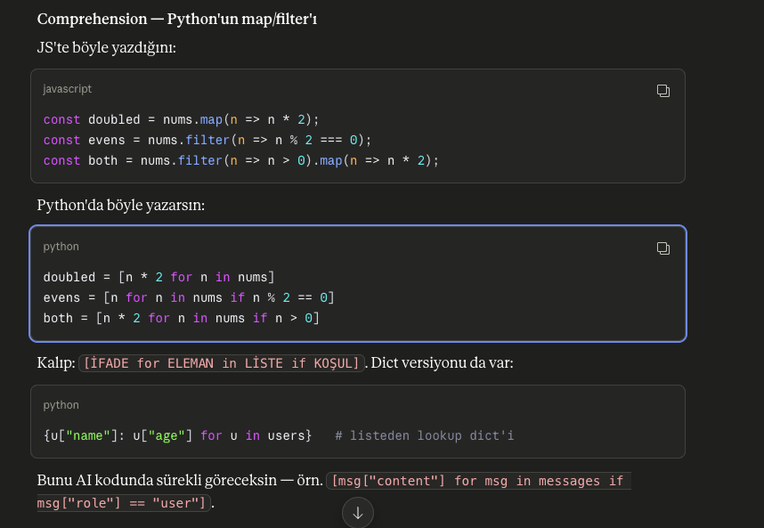

----------------------
## *args (argumants) vs **kwargs (keyword & argumants)
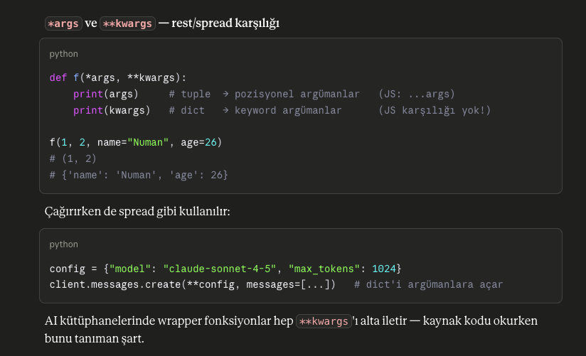

----------------------
## Lambda - Arrow func benzer ama çok kısıtlı kullanım.
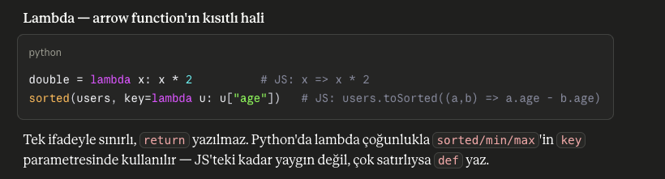

----------------------
## Function Tanımlamaları ve argüman kullanımları
def.py herşeyi açıklıyor

----------------------
## Try-Catch
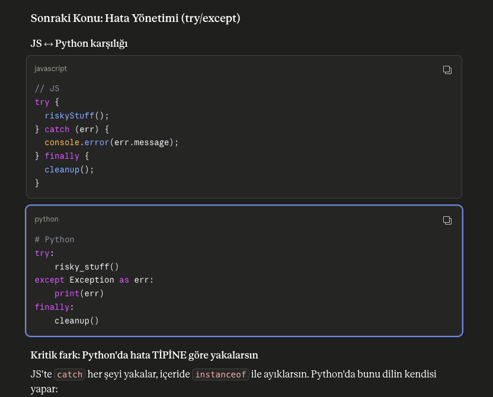

    Sık göreceğin built-in hatalar: ValueError, KeyError, TypeError, IndexError, FileNotFoundError, ConnectionError.
    Not: except Exception: ile her şeyi yakalamak (JS'teki boş catch {} gibi) — gerçek bug'ları da yutar. Sadece beklediğin hataları yakala.
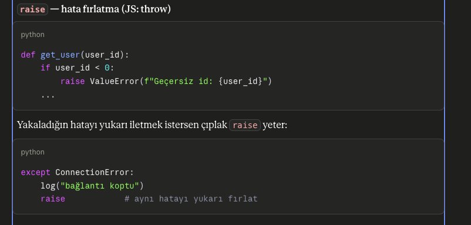

Else sadece hata olmazsa çalışır
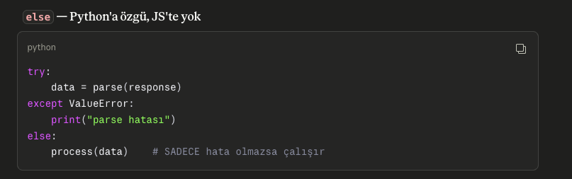

** Neden ÖNemlidir?
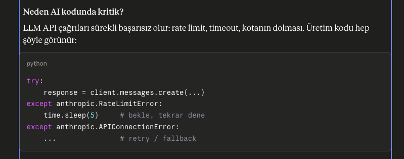

Exception kontrol ve koşulları?
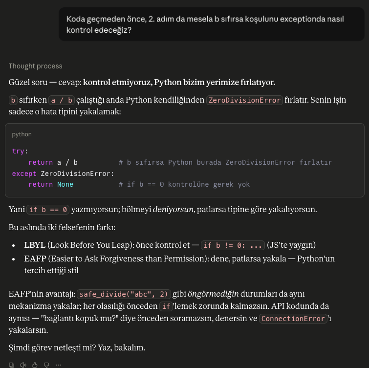

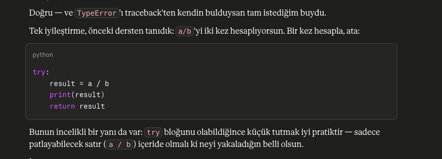

----------------------
# Moduller ve Import Yapısı
JS ve Python import yapısı
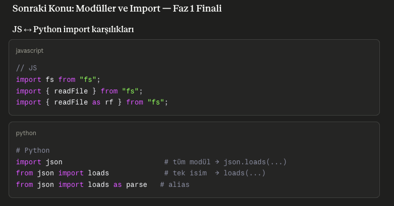

Pythonda export yoktur, her şey otomatik exporttur
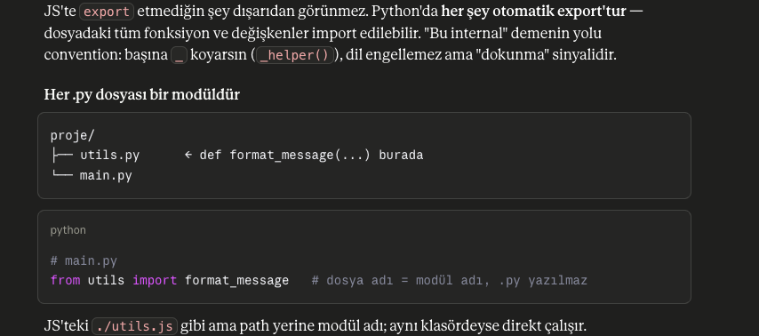