## 1-Type Hints
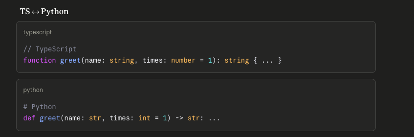

## 2-Değişken ve Koleksyon tipleri
    Tuple

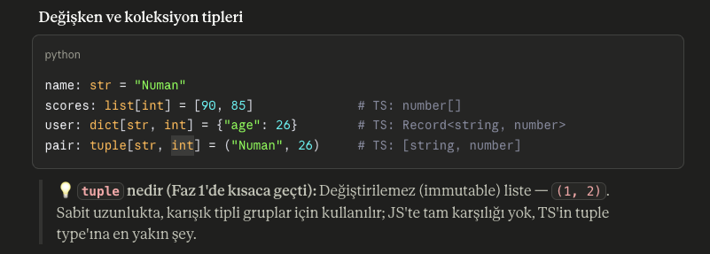

## 3-Dataclasses
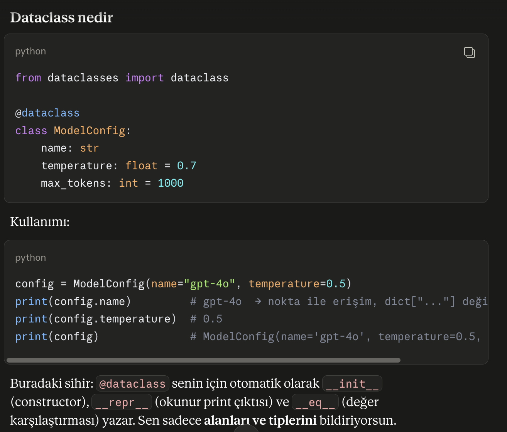

### 3.1-Birkaç kritik nokta:

- Alan sırası önemli — default'suz alanlar, default'lu alanlardan önce gelmeli (aynı fonksiyon parametrelerindeki gibi).
- Mutable default tuzağı yine burada — hatırla, fonksiyonlarda items=[] yasaktı. Dataclass'ta liste/dict default'u için field kullanılır:
    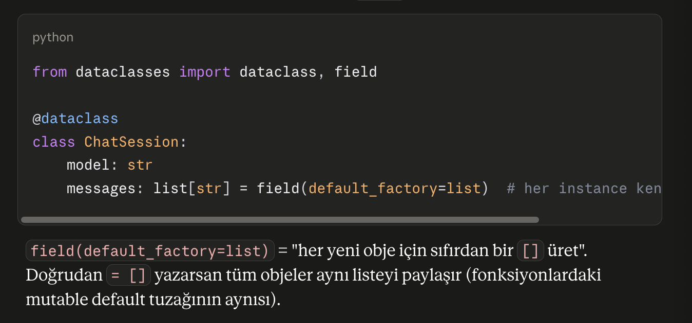
### 3.2-Dataclass ile ilg 2 özellik:
1. Aynı dataclass üzerinden oluşturulan aynı içerikli obje karşılaştırması dataclass özelliği olarak kimlik değil değer karşılaştırması üzerinden değerlendirilir. 
    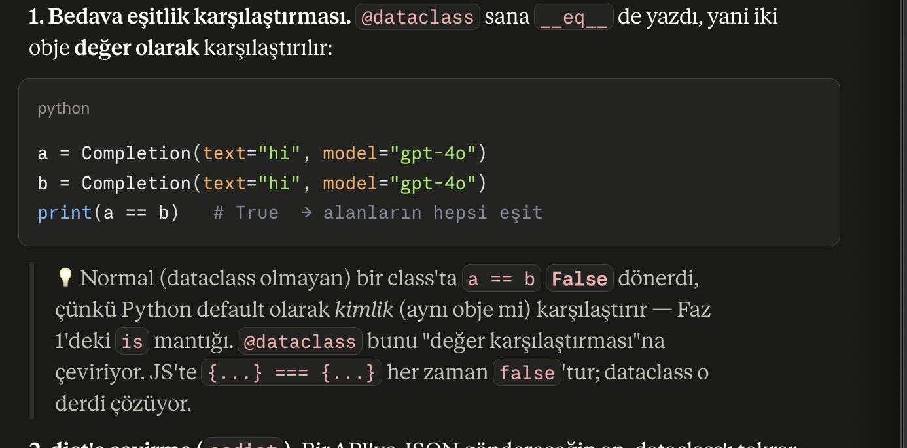
2. Dict'e çevirme: Dataclass objesyi Bir API'ye JSON şeklinde göndermek istediğinde dict şeklinde göndermen gerekir. bu yüzden dict e çevirmen gerekir (asdict):
    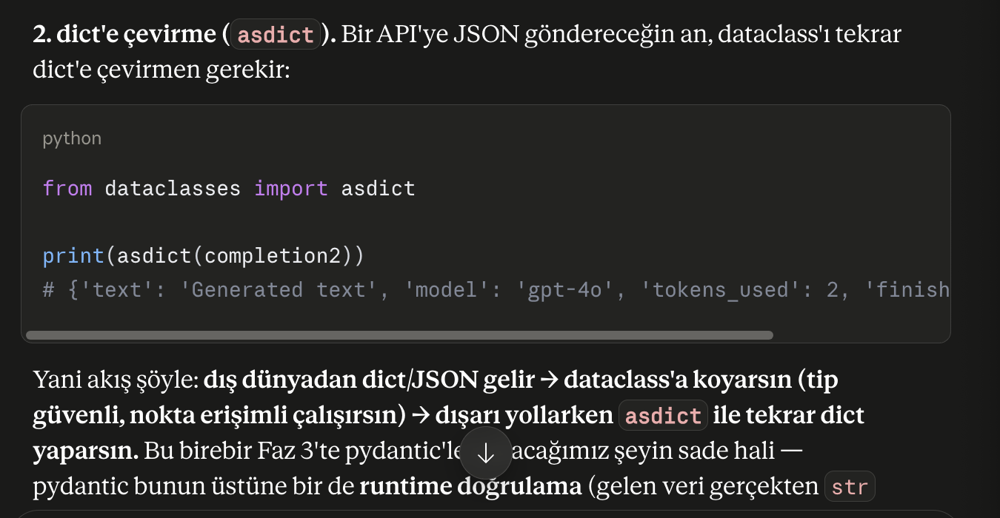

## 4-Decorators
Pratikte ne işine yarar?

En sık şu durumlarda görürsün: bir fonksiyonu çalıştırmadan önce/sonra ortak bir iş yapmak (loglama, süre ölçme, yetki kontrolü, önbellekleme) veya bir fonksiyonu bir sisteme kaydetmek (FastAPI'nin route'ları gibi). Ortak nokta şu: fonksiyonun kendi içeriğini kirletmeden ona dışarıdan davranış eklemek.
- Temel: Python'da fonksiyonlar da "obje"dir

    Bu, decorator'ların bel kemiği. Bir fonksiyonu değişkene atayabilir, başka fonksiyona argüman olarak geçebilir, bir fonksiyondan geri döndürebilirsin.
    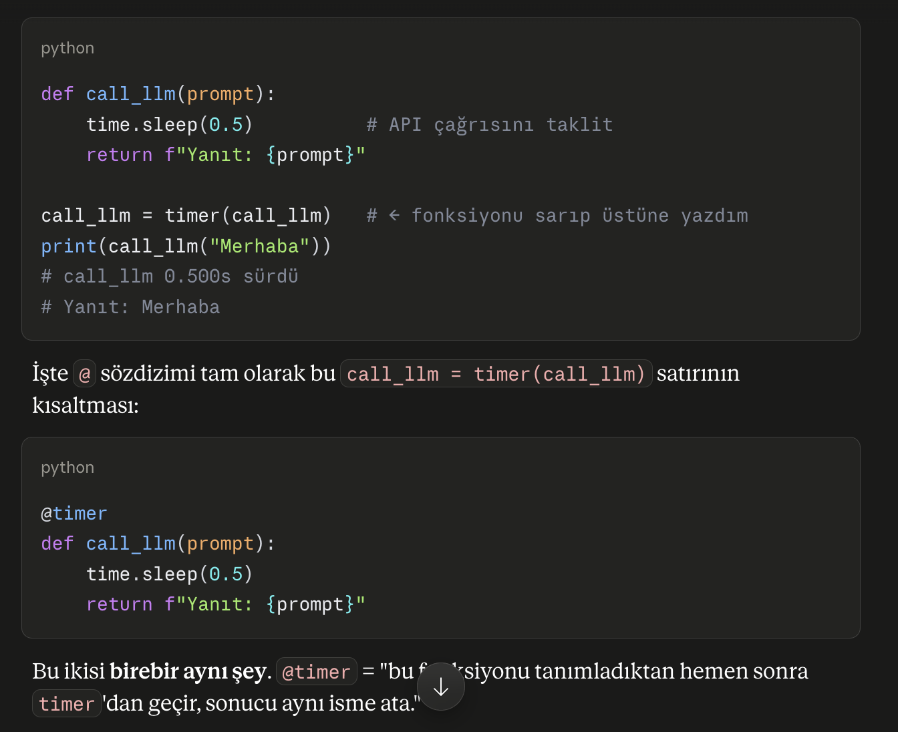
    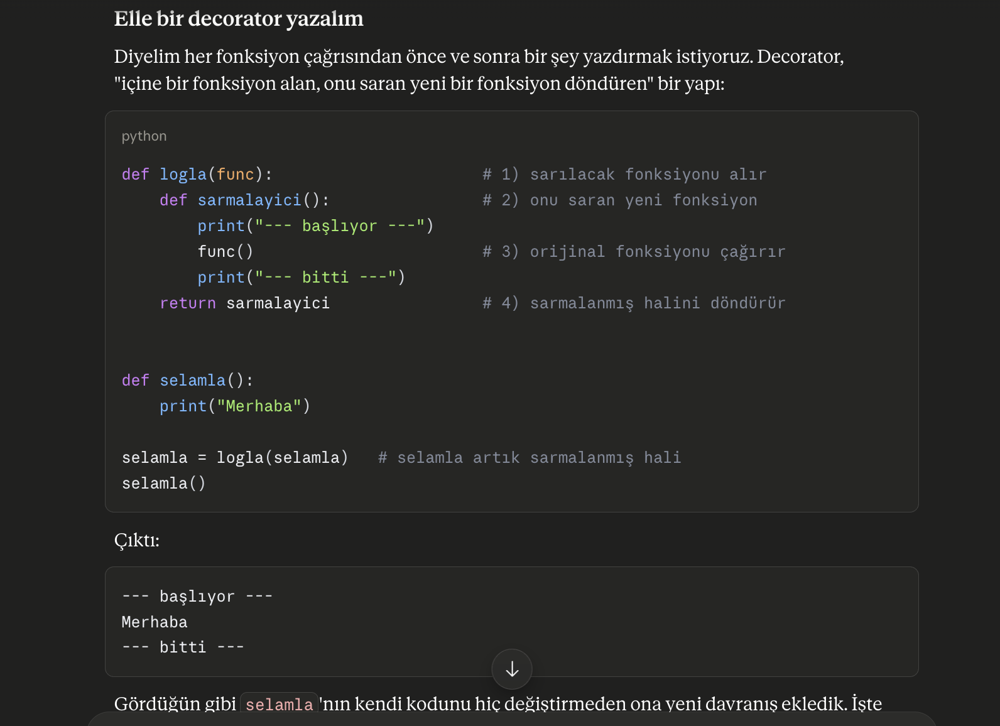
    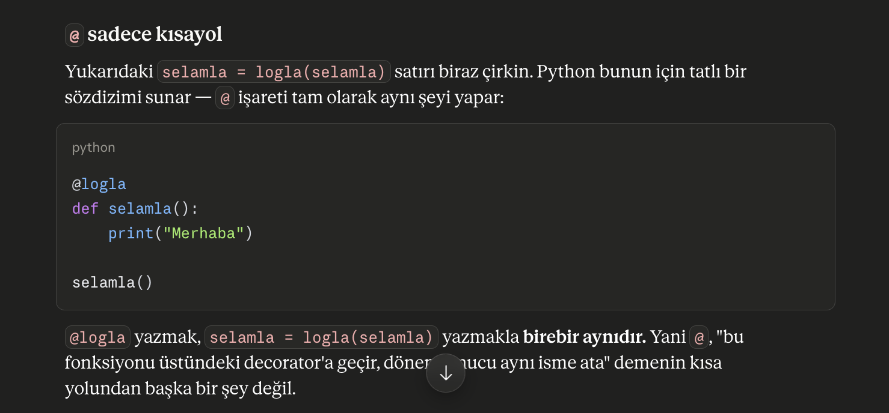

## 5-Generators
    - Generator, "değerleri hepsini birden üretip bir listeye koymak yerine, teker teker, istendikçe üreten" özel bir fonksiyondur. İyi haber: JS'te bunun neredeyse birebir karşılığı var (function* ve yield)

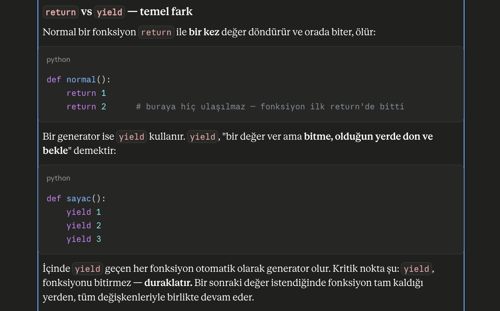
* Nasıl kullanılır?
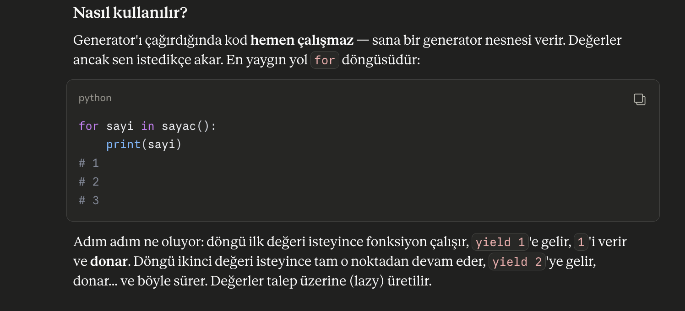
* Asıl faydası: bellek
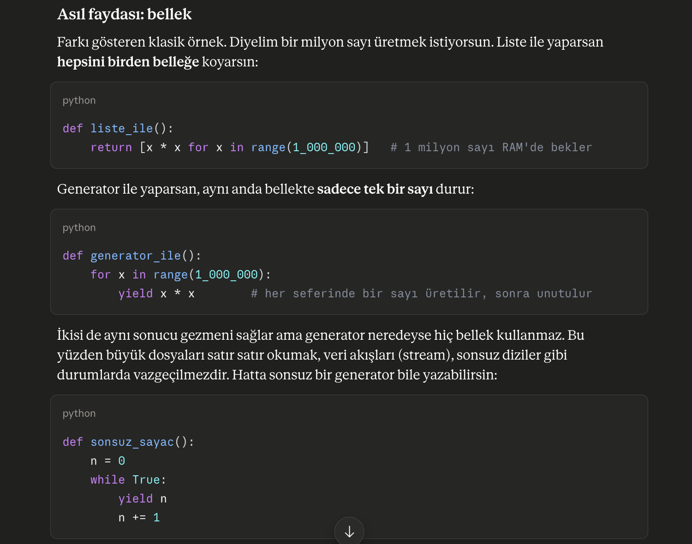
* Genel örnek:
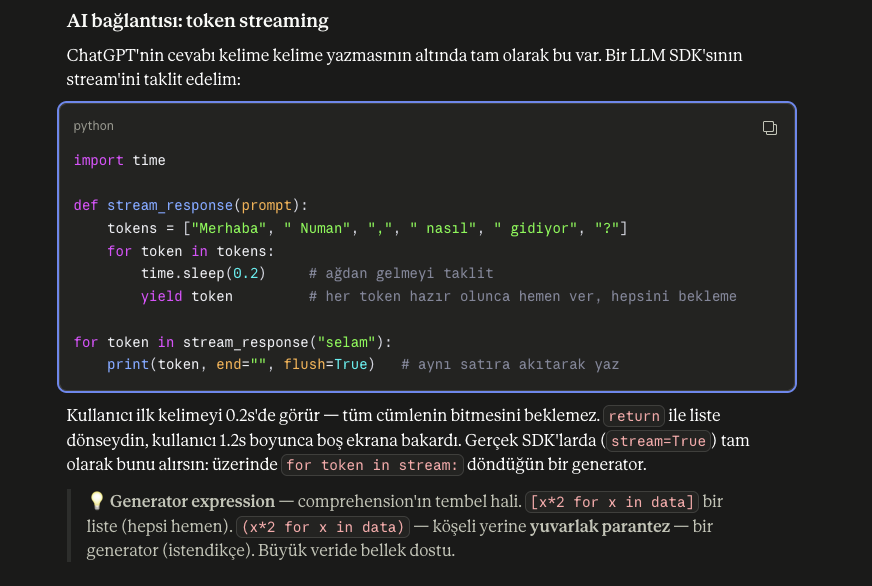

    - List Comprehesion: Python gibi programlama dillerinde mevcut bir listeden veya döngüden kısa, hızlı ve okunabilir yeni bir liste üretme yöntemidir
        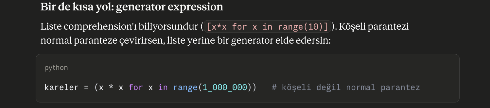

## 6-async/await
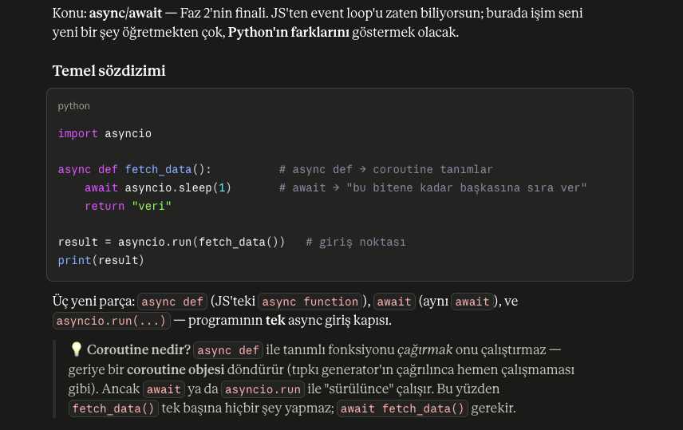

Async yapısının JS ten farkları:
    -   asyncio.run -> JS'te <func_call> yazdığın an fonksiyon hemen çalışmaya başlar ve sana çalışan bir Promise döner. Python'da ise coroutine tembeldir: onu ya await etmen ya da bir event loop'a vermen gerekir, yoksa ölü durur.
        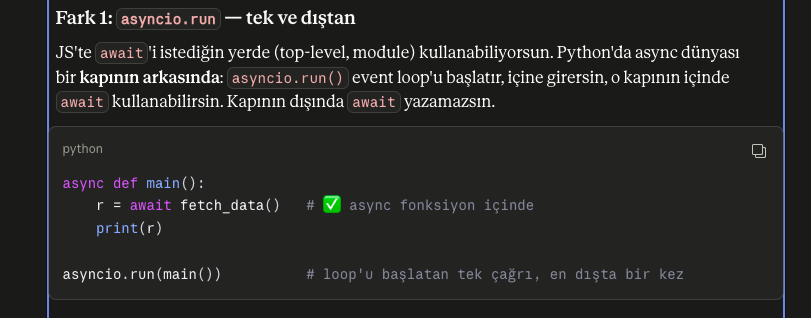
    -   işleri Eşzamanlı yürütmek için: gather
        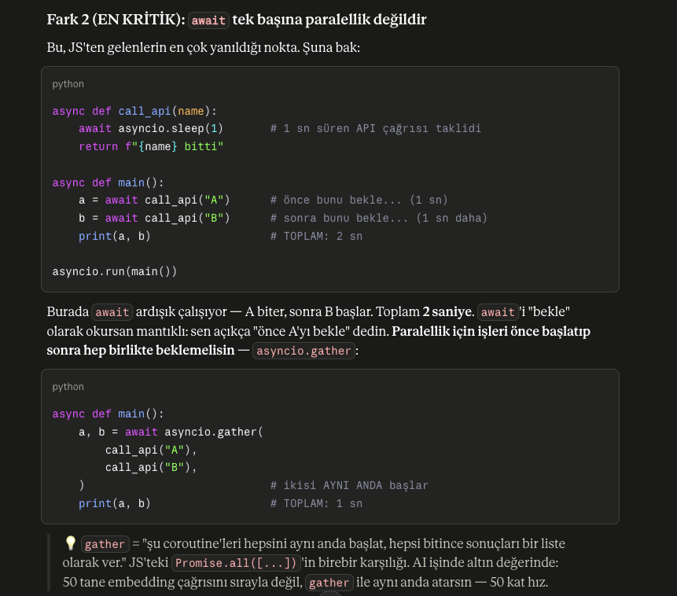