## 1-httpx
-   httpx, Python'ın modern HTTP istemcisidir — JS'teki fetch veya axios gibi. Yani bir sunucuya HTTP isteği (GET, POST vb.) atıp cevabı almak için kullanılır.
-   httpx'in requests (pythonda http istekleri için kullanılan benzer yapı)'ten ayrıldığı asıl nokta: httpx hem senkron hem de async çalışabilir.
    - LLM sdk ler perde arkasında bunu kullanır.
```python
import httpx
# client'ı aç
async with httpx.AsyncClient() as client:
    # istek at, await et
    response = await client.get(url)
    # hata varsa exception fırlat
    response.raise_for_status()
    # JSON gövdesini dict'e çevir
    data = response.json()

```
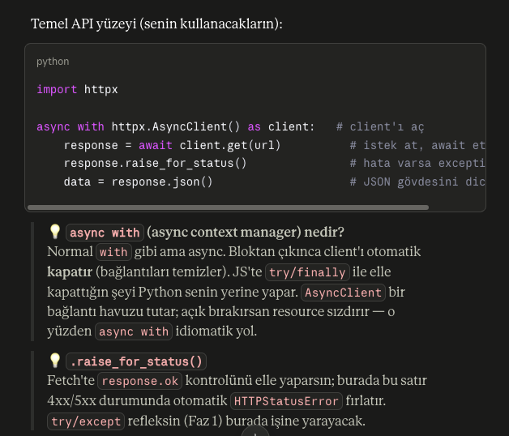
### Neden AsyncClient
    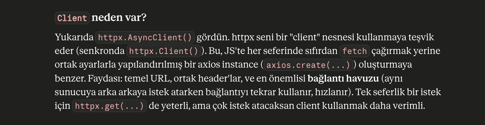

    Örnek kod: 

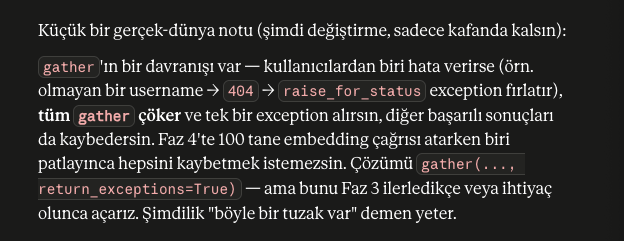

### with
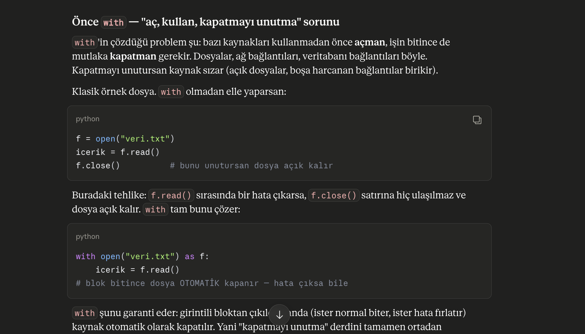

## 2-pydantic
    -   pydantic gelen veriyi runtime'da doğrular ve dönüştürür (coerce eder).
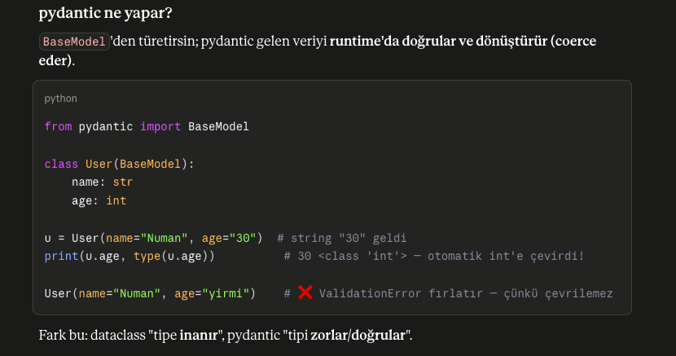
    
    -JS -> pydantic ↔ Zod (TS'te z.object({...})) — birebir aynı iş: runtime schema validation
### BaseModel ve **data ile ignore mod ve strict mod
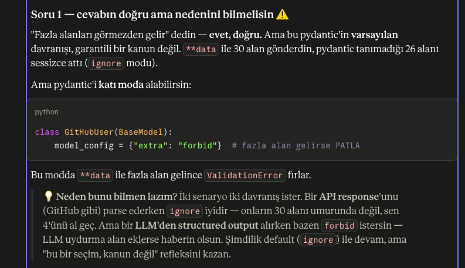

### "Coercion" (zorlama/dönüştürme) nedir?
    pydantic makul dönüşümleri otomatik yapar: 
        "30" → 30, "true" → True. 
    Ama saçma olanı reddeder: 
        "yirmi" → int'e çevrilemez → hata. 
    Bu "esnek ama güvenli" davranış API sınırlarında altın değerinde. (Katı mod da var, ileride görürüz.)

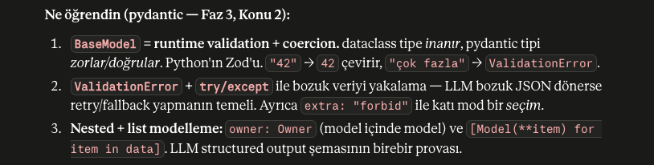

## 3- FastAPI
    Python'ın modern, async-first web framework'ü

- JS ile farkı: 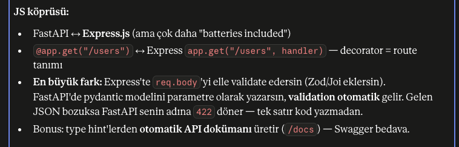

- Temel Örnek: 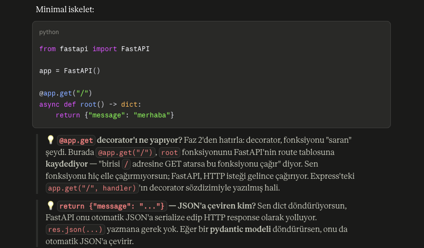

- Çalıştırma için web server sürekli ayakta kalıp istek dinlemeli — o yüzden bir ASGI server (uvicorn) ile çalıştırılır:
    ```bash
        uv add fastapi uvicorn
        uv run uvicorn main:app --reload
    ```
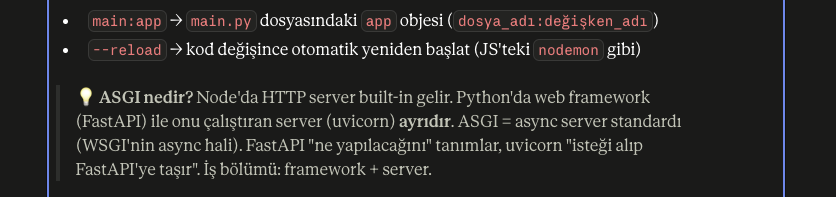

- @app.get'i kodda çağırmadan nasıl tetiklersin:
    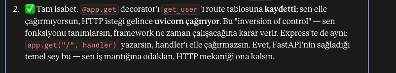

### Özet
- 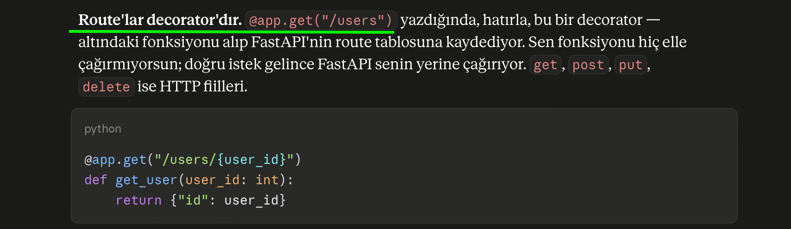

## 4a-NumPY
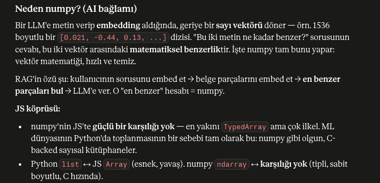
---
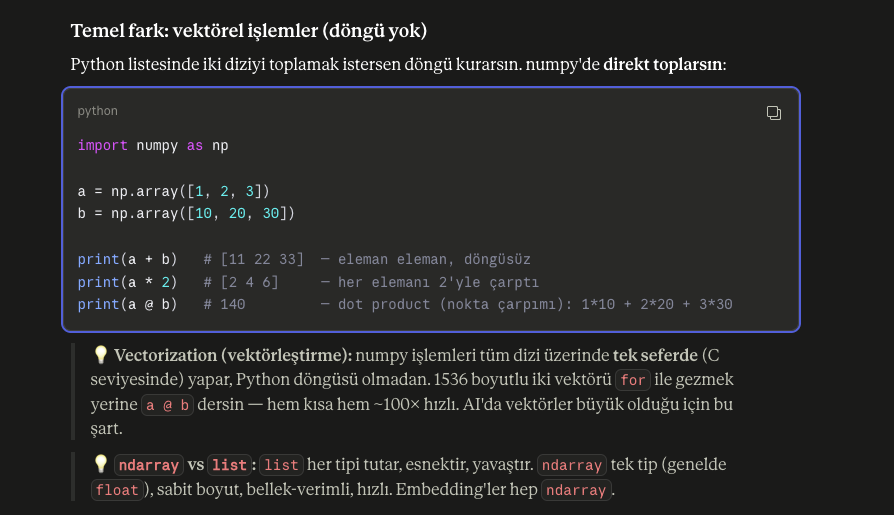
---
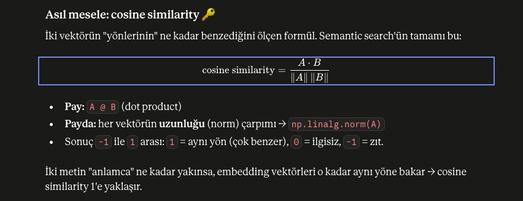
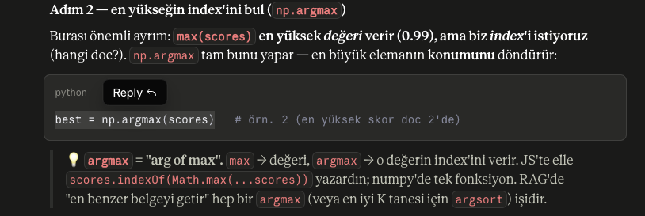
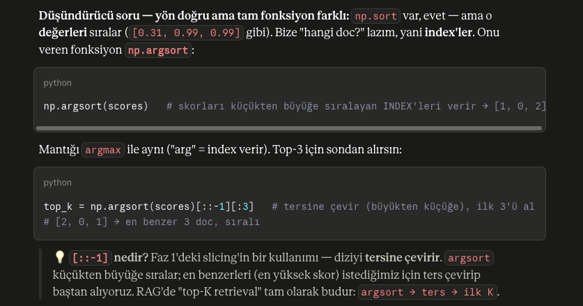

## 4b-Pandas
    Pandas, Python'da tablo biçimindeki veriyi (satırlar ve sütunlar — yani Excel/CSV/veritabanı tablosu gibi) işlemek için kullanılan kütüphanedir. NumPy sayı dizilerinde uzmanken, Pandas "etiketli tablolar" üzerinde çok etkilidir.