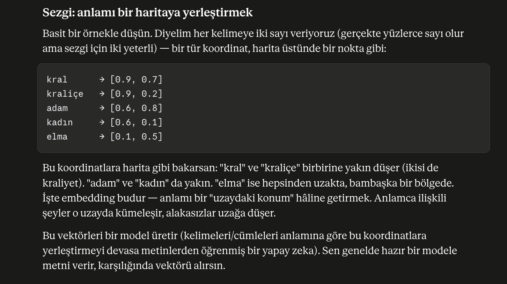

## 1 - Anthropic SDK


### İlk llm çağrısı
```python
    import os
    from dotenv import load_dotenv
    from anthropic import Anthropic

    load_dotenv()
    api_key = os.environ["ANTHROPIC_API_KEY"]

    client = Anthropic()

    response = client.messages.create(
        model="claude-sonnet-4-5",
        max_tokens=1024,
        system="Sen alanında uzman bir çevirmensin; sana verilen İngilizce cümleyi sadece Türkçeye çevir, başka hiçbir şey yazma",
        messages=[
            {"role": "user", "content": "The cat is sleeping on the warm keyboard."}
        ]
    )

    print(response.content[0].text)
```

### Bound nedir?

### Async çağrı ve Sync çağrı:

Async örneği 

## 2 - Structured Output

```python
    from pydantic import BaseModel
    from anthropic import Anthropic

    class ContactInfo(BaseModel):
        name: str
        email: str
        plan_interest: str
        demo_requested: bool

    client = Anthropic()

    response = client.messages.parse(          # create değil → parse
        model="claude-sonnet-4-5",
        max_tokens=1024,
        messages=[{
            "role": "user",
            "content": "Şu e-postadan bilgi çıkar: John Smith (john@acme.com) "
                    "Enterprise planıyla ilgileniyor ve salı 14:00'e demo istiyor.",
        }],
        output_format=ContactInfo,             # pydantic modelini DAYAT
    )

    print(response.parsed_output)              # → doğrulanmış ContactInfo objesi
    print(response.parsed_output.email)        # nokta erişimi, garantili tip 
```

### Ürün yorumundan structured output


### Literal
-   Typescript'te ki union'ların benzeri, fakat kullanım pipe operatoru "|" ile değil Literal ile tanımlanabilir

## 3 - Tool Use/Function calling
    LLM tek başına şunları yapamaz: güncel veriye erişmek (hava, stok, DB'deki sipariş), güvenilir matematik, dış dünyada bir eylem (e-posta gönder, kayıt oluştur). Tool use = modele "şu fonksiyonları çağırabilirsin" demek. Model hangi fonksiyonu ne zaman, hangi argümanlarla çağıracağına kendi karar verir.


## 4 - Embeddings
Embeddings, bir veri kümesinin (kelime, cümle, görüntü, ürün, video...)  sayı listesi ile temsiline — yani bir vektöre — çeviren temsil biçimidir. "sayı listesi" dediğimiz şey aslında az önce konuştuğumuz NumPy dizisinin ta kendisidir. Yani embeddings, NumPy vektörlerinin çok güçlü bir kullanım alanı.
```python
    import voyageai
    import os
    from dotenv import load_dotenv
    import numpy as np

    load_dotenv()
    api_key = os.environ["VOYAGE_API_KEY"]

    vo = voyageai.Client()

    documents = [
        "Python programlama dili veri bilimi için çok popülerdir.",
        "Kediler günde ortalama 15 saat uyur.",
        "FastAPI, async destekli modern bir Python web framework'üdür.",
        "Kahve çekirdekleri kavrulduktan sonra öğütülür.",
    ]

    doc_vecs = vo.embed(documents, model="voyage-4", input_type="document").embeddings

    print("------------")

    query = "async web geliştirme aracı"
    query_vec = vo.embed([query], model="voyage-4", input_type="query").embeddings[0]


    similarities = np.dot(doc_vecs, query_vec)
    best = np.argsort(similarities)[::-1][:2] ## sıralı benzerlik listesinde en yakın 2 içerik seçildi.
    for i in best:
        print(f"{similarities[i]:.3f} → {documents[i]}")
```
Output: 
```
    0.510 → FastAPI, async destekli modern bir Python web framework'üdür.
    0.151 → Python programlama dili veri bilimi için çok popülerdir.
```

### Bilgisayar anlamsal karşılaştırma yapamazlar!
-   Bir bilgisayar için "kral" ve "kraliçe" kelimeleri sadece harf dizileridir — aralarında "sea" ile "kral" kadar yakınlık görür, çünkü ikisi de düz metin. Bilgisayar anlamı, benzerliği doğrudan kavrayamaz. Ama bilgisayar bir şeyi çok iyi yapar: sayıları (matrisler, vektorler ...) karşılaştırmak.
- Embeddings'in fikri şu: her şeyi öyle bir sayı listesine çevirelim ki, anlamca benzer şeyler birbirine yakın sayılara düşsün. Böylece "bu iki şey ne kadar benzer?" sorusu, "bu iki sayı listesi birbirine ne kadar yakın?" sorusuna dönüşür — ki bunu bilgisayar anında hesaplar.


## 5 - RAG (Retrieval Augmented Generation)
LLM modeli eğitildiği veri ve tarih kadar bilgiye sahiptir, eğitimi dışında olan veriler ya da eğitim tarihinden sonra ortaya çıkan verilerden bihaberdir. Bu LLM içinde user'lara tutarsız ve güncel olmayan ya da halisünatif veriler üretmesine sebep olur. Bunun için güncel veri çekebilen ya da senin özelleştirdiğin verilerden beslenebilen (şirket dökümanı, ürün veri tabanı, kişisel notlar vs) bir dış dünya bağlantısı ile iletişimde olması gerekir. İşte bu noktada dışardan ihtiyaç halinde verileri çekme işini RAG çözer.
RAG'ın iki aşaması:
-   İndeksleme (offline, bir kere): Belgeleri parçalara böl (chunk) → her chunk'ı embed et → sakla.
-   Sorgu (online, her soruda): Soruyu embed et → en benzer chunk'ları bul (retrieve) → prompt'a koy (augment) → LLM cevap versin (generate).

### Grounding
-   Grounding talimatı, prompt içinde llm i kısıtlayacak ve halisünasyonlara karşı önlem olan bir yapıdır.
- XML taglar context'leri ayırır ve llm'i prompt injection'lara karşı daha güçlü kılar. Çünkü model bu taglar sayesinde eğer döküman içinde injection varsa bunun bir talimat değil retrive verisi olduğunu bilir ve aksiyon almaz.