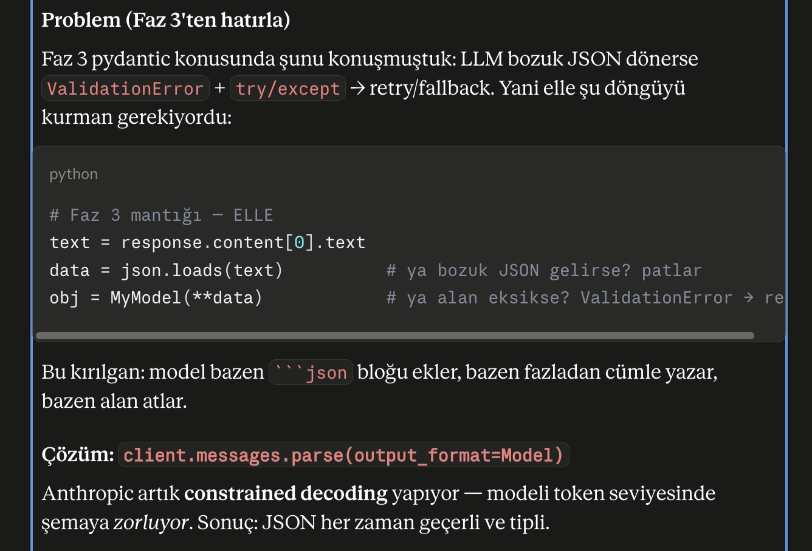
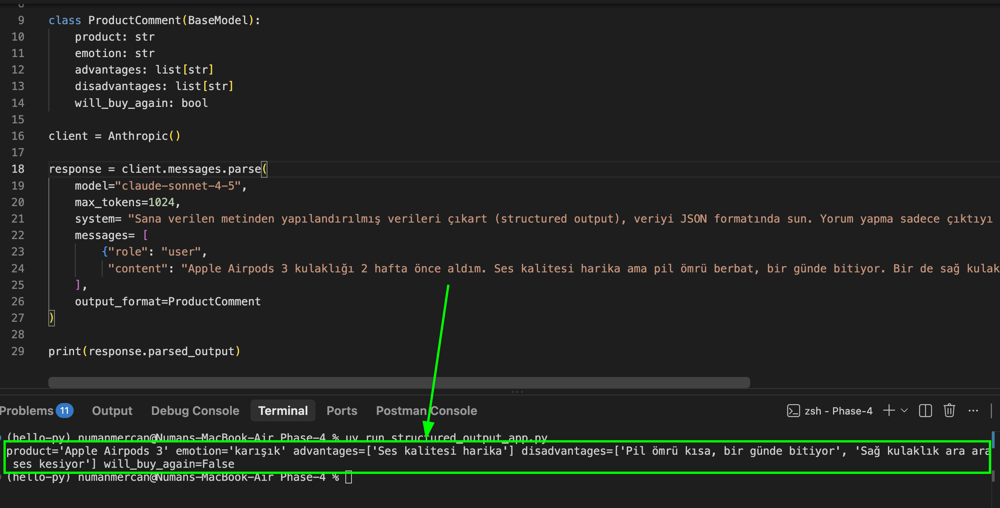
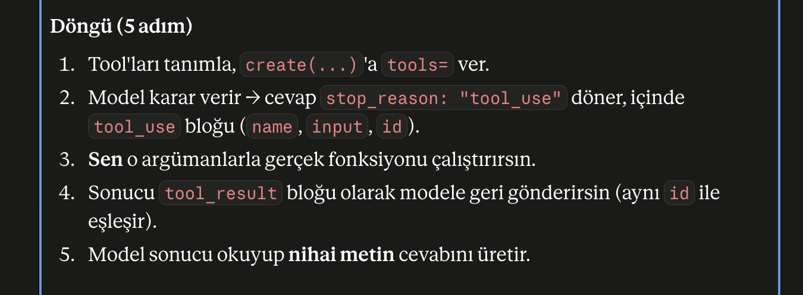

## 1 - Anthropic SDK


### İlk llm çağrısı
```python
    import os
    from dotenv import load_dotenv
    from anthropic import Anthropic

    load_dotenv()
    api_key = os.environ["ANTHROPIC_API_KEY"]

    client = Anthropic()

    response = client.messages.create(
        model="claude-sonnet-4-5",
        max_tokens=1024,
        system="Sen alanında uzman bir çevirmensin; sana verilen İngilizce cümleyi sadece Türkçeye çevir, başka hiçbir şey yazma",
        messages=[
            {"role": "user", "content": "The cat is sleeping on the warm keyboard."}
        ]
    )

    print(response.content[0].text)
```

### Bound nedir?

### Async çağrı ve Sync çağrı:

Async örneği 

## 2 - Structured Output

```python
    from pydantic import BaseModel
    from anthropic import Anthropic

    class ContactInfo(BaseModel):
        name: str
        email: str
        plan_interest: str
        demo_requested: bool

    client = Anthropic()

    response = client.messages.parse(          # create değil → parse
        model="claude-sonnet-4-5",
        max_tokens=1024,
        messages=[{
            "role": "user",
            "content": "Şu e-postadan bilgi çıkar: John Smith (john@acme.com) "
                    "Enterprise planıyla ilgileniyor ve salı 14:00'e demo istiyor.",
        }],
        output_format=ContactInfo,             # pydantic modelini DAYAT
    )

    print(response.parsed_output)              # → doğrulanmış ContactInfo objesi
    print(response.parsed_output.email)        # nokta erişimi, garantili tip 
```

### Ürün yorumundan structured output


### Literal
-   Typescript'te ki union'ların benzeri, fakat kullanım pipe operatoru "|" ile değil Literal ile tanımlanabilir

## 3 - Tool Use/Function calling
    LLM tek başına şunları yapamaz: güncel veriye erişmek (hava, stok, DB'deki sipariş), güvenilir matematik, dış dünyada bir eylem (e-posta gönder, kayıt oluştur). Tool use = modele "şu fonksiyonları çağırabilirsin" demek. Model hangi fonksiyonu ne zaman, hangi argümanlarla çağıracağına kendi karar verir.
