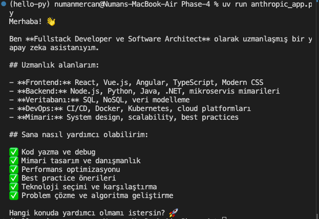
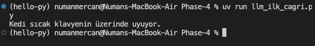
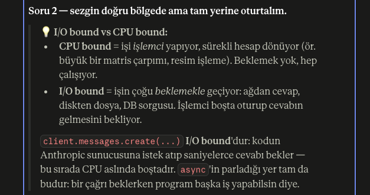
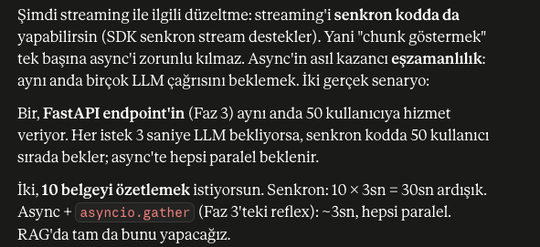

## Anthropic SDK



### İlk llm çağrısı
```python
    import os
    from dotenv import load_dotenv
    from anthropic import Anthropic

    load_dotenv()
    api_key = os.environ["ANTHROPIC_API_KEY"]

    client = Anthropic()

    response = client.messages.create(
        model="claude-sonnet-4-5",
        max_tokens=1024,
        system="Sen alanında uzman bir çevirmensin; sana verilen İngilizce cümleyi sadece Türkçeye çevir, başka hiçbir şey yazma",
        messages=[
            {"role": "user", "content": "The cat is sleeping on the warm keyboard."}
        ]
    )

    print(response.content[0].text)
```

### Bound nedir?

### Async çağrı ve Sync çağrı:

Async örneği 