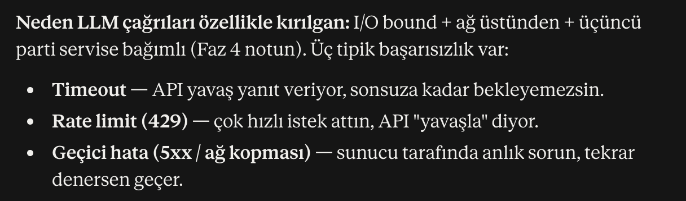
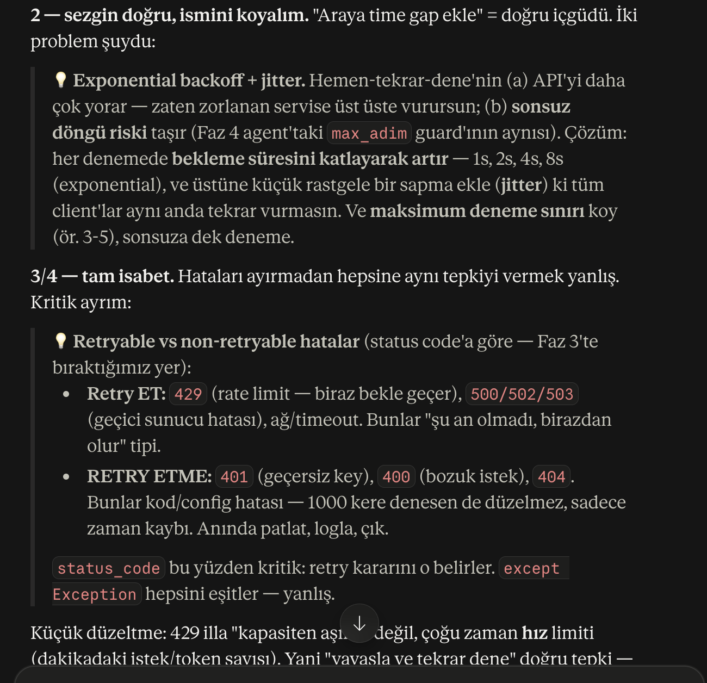
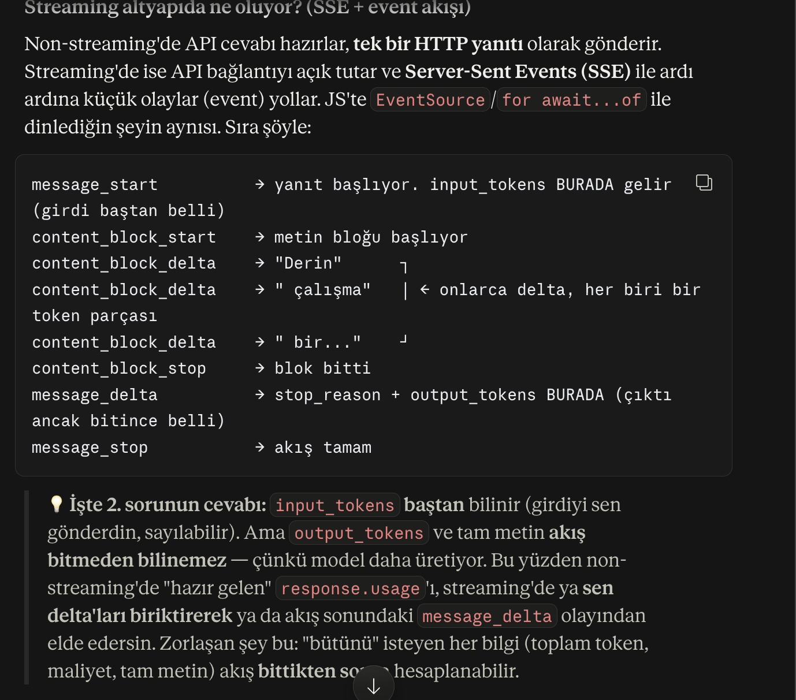
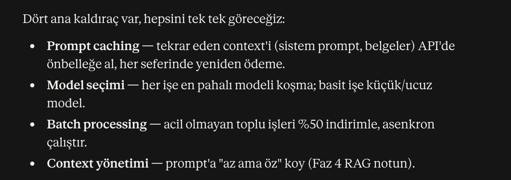
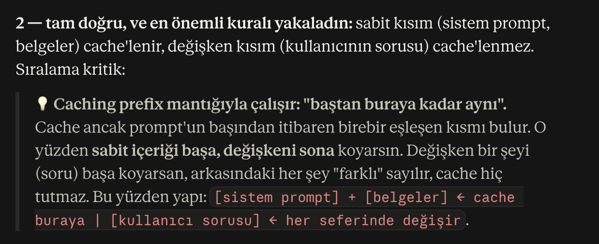
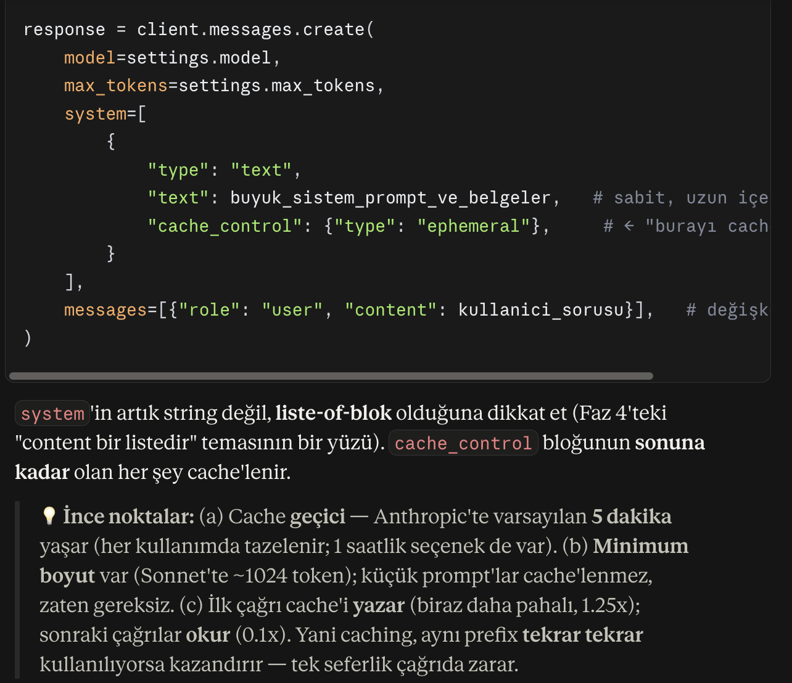

## 1 - Config '.env' & Secrets Management


## 2 - Logging & Observability


**Öz:** `print` üretimde borçtur → `logging` kullan (seviye, zaman, kaynak, hedef bedava).

### Can alıcı noktalar
- **Seviyeler:** DEBUG < INFO < WARNING < ERROR < CRITICAL. Eşiği ayarlarsın, kod değişmez.
- **Lazy format:** `logger.info("x=%s", x)` (virgül) — `+`/f-string DEĞİL. Eşik kapalıysa string kurulmaz.
- **Hata:** `try/except` içinde `logger.exception(...)` → stack trace otomatik. Sonra `raise` (sessiz yutma).
- **Üçüncü parti gürültü:** `logging.getLogger("httpx").setLevel(logging.WARNING)`.
- **dotenv farkı:** `pydantic-settings` `os.environ`'a yazmaz → SDK'ya key'i elle ver: `Anthropic(api_key=settings.anthropic_api_key)`.
- **Maliyet:** fiyat = referans veri (kod/`pricing.py`, `.env` değil). `dict.get()` + açık `raise` (fail-fast).
    
    

### Örnek
```python
import logging
logging.basicConfig(level=logging.INFO,
    format="%(asctime)s | %(levelname)s | %(name)s | %(message)s")
logger = logging.getLogger(__name__)

try:
    r = client.messages.create(...)
    logger.info("Token | in=%s out=%s",
        r.usage.input_tokens, r.usage.output_tokens)
except Exception:
    logger.exception("LLM başarısız")
    raise
```

## 3 - Resiliance (Dayanıklılık)
    Tamam try/cath, logging ile hataları yakalayıp, bazı kayıtları görebiliyorsun. Peki hataları yakaladıktan sonra ne olacak? Programın sonlanması ya da hata kaydının verilip durması iyi bir user experience olmayacaktır. Sonrasını handle edebilecek bir akışa sahip olmalı projenki dayanıklı -resiliance- proje olsun.





## 4 - Streaming
    ChatGPT'de Kullanıcı LLM e bir girdi verip cevabını çok kısa sürede kelimelerin ekrana akması şeklinde görebiliyor. Bu da kullanıcının uzun süre boş ekrana bakmaya karşı yaşadığı kötü deneyimi handle eden streaming kavramını açıklıyor.
    10-15 saniye bomboş loading yerine hemen akmaya başlayan böylece sıkılmasını engelleyen bir yapı sağlıyor.

**Öz:** Yanıtı bütün beklemek yerine token token akıtırsın → ilk kelime ~1s'de görünür, algılanan hız artar. Bu, Faz 2'deki generator'ın (`yield`, lazy) LLM yüzüdür; altyapıda **SSE (Server-Sent Events)** ile event akışı gelir.

### Can alıcı noktalar
- **Desen:** `with client.messages.stream(...) as stream:` (context manager, ağ kaynağını düzgün kapatır) → `for t in stream.text_stream: print(t, end="", flush=True)`.
- **`end=""`**: `print`'in eklediği `\n`'i engeller, parçalar yan yana akar. **`flush=True`**: çıktı tampona takılmasın, hemen ekrana bassın (dosyaya/pipe'a yönlendirince fark dramatik).
- **Bütünü akış BİTİNCE al:** `input_tokens` baştan bellidir ama `output_tokens` + tam metin ancak akış bitince belli olur. `stream.get_final_message()` → `.usage`, `.content[0].text` (SDK arka planda biriktirir). Token/maliyet log'unu **döngüden SONRA** koy.
- **Tek kullanımlık:** `text_stream` bir generator → tükettikten sonra tekrar dönemezsin; ama `get_final_message()` bütünü saklar.
- **Granülarite API'nin:** parça = token (yarım/çok kelime olabilir). "Harf harf" akış = client tarafı **kozmetik daktilo** (`time.sleep`); ağı hızlandırmaz, sadece görüntü. Üretimde efekti frontend'de yap.
- **Hatırlatma:** streaming'i de `try/except` ile sar (timeout/rate-limit yine olur).
### FAQ


## 5- Costs & Performance
    her çağrının maliyetini logladın — tek çeviri $0.0005. Küçük görünüyor. Ama ölçekte düşün: RAG uygulaman günde 50.000 soru alıyor, her soruda 20 chunk context gönderiyorsun. Aynı sistem prompt'u ve aynı belgeler her seferinde baştan işleniyor. Aylık fatura birden binlerce dolar. Bu konu, aynı işi daha ucuz ve daha hızlı yapmanın kaldıraçlarıyla ilgili.
- 4 Konsept ile handling:




- Ne zaman cachle
