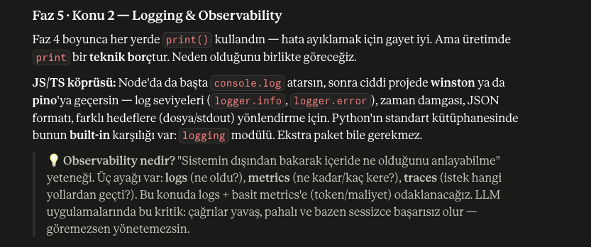
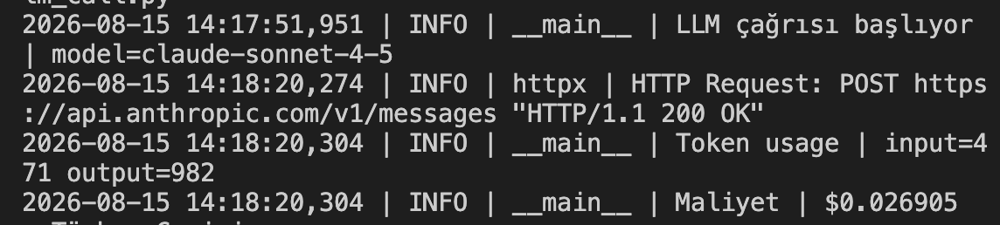

## 1 - Config '.env' & Secrets Management


## 2 - Logging & Observability


**Öz:** `print` üretimde borçtur → `logging` kullan (seviye, zaman, kaynak, hedef bedava).

### Can alıcı noktalar
- **Seviyeler:** DEBUG < INFO < WARNING < ERROR < CRITICAL. Eşiği ayarlarsın, kod değişmez.
- **Lazy format:** `logger.info("x=%s", x)` (virgül) — `+`/f-string DEĞİL. Eşik kapalıysa string kurulmaz.
- **Hata:** `try/except` içinde `logger.exception(...)` → stack trace otomatik. Sonra `raise` (sessiz yutma).
- **Üçüncü parti gürültü:** `logging.getLogger("httpx").setLevel(logging.WARNING)`.
- **dotenv farkı:** `pydantic-settings` `os.environ`'a yazmaz → SDK'ya key'i elle ver: `Anthropic(api_key=settings.anthropic_api_key)`.
- **Maliyet:** fiyat = referans veri (kod/`pricing.py`, `.env` değil). `dict.get()` + açık `raise` (fail-fast).
    
    

### Örnek
```python
import logging
logging.basicConfig(level=logging.INFO,
    format="%(asctime)s | %(levelname)s | %(name)s | %(message)s")
logger = logging.getLogger(__name__)

try:
    r = client.messages.create(...)
    logger.info("Token | in=%s out=%s",
        r.usage.input_tokens, r.usage.output_tokens)
except Exception:
    logger.exception("LLM başarısız")
    raise
```